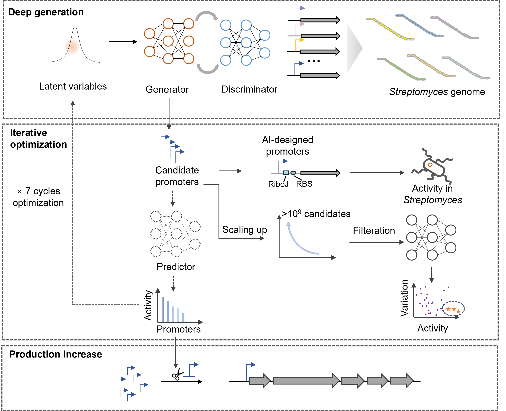

# StreProm
*Wang Ye edited on Oct 22, 2025*

This repository contains the code for the paper:
**Deep learning-enabled de novo design of synthetic promoters for enhanced natural product biosynthesis in Streptomyces**.


# Introduction

Streptomyces play a pivotal role in the discovery and production of natural products, making them exceptionally promising for industrial applications. Since Streptomyces originated natural products faced the challenge of insufficient yield, expanding Streptomyces promoter libraries is essential so as to upregulate the expression of endogenously gene clusters. We employed a deep generative framework that captured the characteristics of natural promoters from extensive transcriptome data. Through iterative optimization via machine learning, AI designed 1 billion artificial candidate sequences *in silico*. 


<p align="center">
  
</p>

The top 100 candidates of AI-deisnged novel promoters selected by predition model were validated in 4 different Streptomyce species (*Streptomyces* A-14, *S. coelicolor* M1146, *S. albus*, and *Streptomyces* T2-4) over six days. Among these promoters, 92% were validated to be functional, with 7 promoters (Srasp8, Srasp26, Srasp47, Srasp50, Srasp57, Srasp60, Srasp61)  surpassing the promoter activity of the strong promoter *kasO*p*. Moreover, the novel AI-designed promoters exhibited substantial sequence diversity with low similarity to their natural counterparts found in bacterial genomes. 

AI-designed promoters were then integrated into the “plug and play” platform [1] to activate the indigoidine and PTM biosynthetic gene clusters (BGCs) in Streptomyces. Consequently, these promoters significantly enhanced the production yields of three non-ribosomal peptide synthetases (NRPSs) and one polyketide. Overall, our findings demonstrate that these engineered promoters enable efficient biosynthetic gene expression, advancing the development and commercialization of valuable natural products in Streptomyces cell factories.

# Preparation

## Environment Setup
## Installation
```bash
conda create -n streprom python=3.9
conda activate streprom
cd StreProm
pip install -r requirements.txt
```

## Dataset Preparation

The natural promoters were collected from the dRNA-seq data of 6 different Streptomyces species reported in previous studies[2,3], including *S.avermitilis* MA-4680, *S.clavuligerus* ATCC 27064, *S.griseus*, *S.lividans* TK24, *S.tsukubaensis* NRRL18488, *S.venezuelae* ATCC15439. The corresponding genome sequences of these bacteria species were downloaded from National Center for Biotechnology Information (NCBI) RefSeq 2 release 204 databases (accessed on 2021 May 20). To augment the dataset, we also collected 3239 candidate promoter sequences from GEO database by previous studies[4]. 

To deal with the problem that GEO annotated gene start sites are generally not accurate transcription start sites, we extracted the -100 to +100 bases relative to the annotated gene start site in GEO database and change them into 80 nt sliding window with a step size of 1 nt. These windows were input into BacPP[5] for scoring. The 80nt sequences with negative BacPP scores were filtered out, leaving 975 sequences remaining. In total, 3493 promoters and their corresponding gene expression levels were collected and all utilized as training dataset for the generative model.

This table shows the discription of input datasets used in this paper:
| Folder Name | Description| Dataset|
| ------ | ------ |------ |
| input_promoter_sequences | Combined the promoter sequences from dRNA-seq[2,3] and GEO database after evaluated by BacPP  | input_sequences.txt 
| sequence_activity| Sequence-activity paired data |  sequence_activity_train_norepeat.npy | 


# Design novel functional promoter  in *Streptomyces*

StreProm is composed of a number of modules that can be imported as follows:

**Round 1 :**

- `Generation`.The initial pool consists of 2332 candidate sequences. 
- `Predictive`.Trained on dRNA-seq data[2] and RNA-seq data(GEO)[3]. **The activities here were calculated using the average activities of four different time points, as follows: early-exponential (E), transition (T), late-exponential (L), and stationary(S)[2]**.This model was trained with 3144 samples as the training set, 427 samples as the validation set and others as the testing set.

**Round 2 / Final :**

- `Generation`.A pool of over 1 billion AI-generated candidate promoters was generated.
- `Prediction`. All of the generated sequences were scored and filtered by prediction model to retain the highly-expressed top-performing hits. The `predictive model` was then refined using the experimentally validated activities of these hit promoters in Streptomyces, further improving prediction accuracy.
- `Optimization`.Genetic Algorithms, based on refined `predictive model`. During the *in silico* optimization process, the WGAN-GP model was integrated with a genetic algorithm (GA)-based evolutionary optimization, iterated over 7 cycles to generate optimized promoter candidates.


## Generation

The codes in `Step1_generation.py` provide all necessary process for training and generating candidate promoters by generative models, in all two rounds.

## Evaluation

The codes in `Step2_evaluation.py` provide all necessary process for evaluating natural and AI-designed sequences.

## Prediction

The codes in `Step3_prediction_r1.py` and `Step4-prediction_r2.py` provide all necessary process for training and evaluating predictive models for two rounds, separately.

## Optimization

The codes in `Step3-optimization.py` provide the process needed for genetic algorithm, for getting the species-specific and cross-species data in the final round.

## Output datasets
This table shows the discription of output datasets:
| Folder Name | Description| Dataset|
| ------ | ------ |------ |
| round1_100_filtered_sequences| Validated 100 candidate sequences filtered by predictive model in round1 |round1_100_filtered_candidates.txt 
| round1_100_GA_sequences| Validated 100 candidate sequences in round1 optimized by genetic algorithm | round1_100_GA_candidates.txt 
| round2_100_candidate_sequences | Validated 100 candidate sequences in round2 | round2_1billion_100_candidates.txt| 


# License
For academic use, this project is licensed under the MIT License (see the LICENSE file for details). For commercial use, please contact the authors.

# Citations
~~~
[1] Zhang, Mingzi M., et al. "CRISPR–Cas9 strategy for activation of silent Streptomyces biosynthetic gene clusters." Nature chemical biology 13.6 (2017): 607-609.
[2] Kim, Woori, et al. "Transcriptome and translatome profiles of Streptomyces species in different growth phases." Scientific data 7.1 (2020): 138.
[3] Lee, Yongjae, et al. "Genome-scale determination of 5´ and 3´ boundaries of RNA transcripts in Streptomyces genomes." Scientific Data 7.1 (2020): 436.
[4] Otani, Hiroshi, Daniel W. Udwary, and Nigel J. Mouncey. "Comparative and pangenomic analysis of the genus Streptomyces." Scientific reports 12.1 (2022): 18909.
[5] e Silva, Scheila de Avila, Sergio Echeverrigaray, and Günther JL Gerhardt. "BacPP: bacterial promoter prediction—a tool for accurate sigma-factor specific assignment in enterobacteria." Journal of theoretical biology 287 (2011): 92-99.
[6] Wang, Haochen, et al. "GPro: generative AI-empowered toolkit for promoter design." Bioinformatics 40.3 (2024): btae123.
~~~


# Support
If you have any questions, don't hesitate to open an issue. Every contribution is highly apprecieated!


